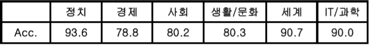

# 어텐션 기반 Bi-LSTM을 이용한 한국어 뉴스 분류
## 설명
이 repository에는 Python을 이용한 한국어 뉴스 분류를 위한 데이터 수집 과정(Crawling), 전처리(Preprocess), 모델(model),
학습과정(train)이 자세한 설명과 함께 포함되어 있습니다.
텍스트 분류는 자연어 처리에서 가장 기본적이고 중요한 작업중 하나인데, 이 repo에서는 한국어 뉴스 분류(n_category : 6)
를 하였습니다.

  * 한국어 뉴스 기사 수집 (Naver News Crawling.ipynb)
  * 뉴스 기사 전처리, Vocabulary생성
  * 모델 (Attention based Bi-LSTM)
  * 학습과정 (train)

Python Server, Client(C# WPF)가 동기식 소켓통신을 하면서, Client가 뉴스를 보내면 Server에서 학습된 모델로 예측한 결과를 전송해주는 코드도 포함하였습니다.

  * Server(Python Server)
  * Client(C# WPF)

## 모델 구조

 

## 실험 결과
###Table 1. Accuracy for test dataset
 

형태소 단위로 분절한 뉴스기사에 Attention을 적용하여 높은 성능을 내는 것을 볼 수 있습니다.

###Table 2. Accuracy for each field in the trained model
 

###Table 3. Probability for each field when predict is wrong 
 

위 표는 Test에서 예측이 틀렸을 경우 정답에 대해 어떠한 예측을 했는지 분포를 나타낸 표이다. 생활/문화 분야는 사회 분야로 잘못 예측될 가능성이 높은 것으로 보인다.

## 참조

  * prakashpandey9/[Text-Classification-Pytorch][1]
  * jason9693/[NNST-Naver-News-for-Standard-and-Technology-Database][2]

[1]:https://github.com/prakashpandey9/Text-Classification-Pytorch
[2]:https://github.com/jason9693/NNST-Naver-News-for-Standard-and-Technology-Database